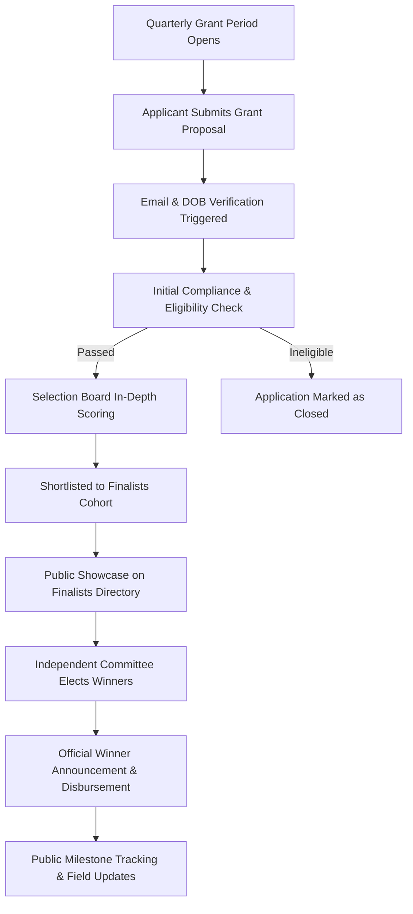

# IFundAyiti — Transparent Micro-Grants for Haitian Changemakers


> **IFundAyiti** is an equity-free micro-grant and community crowdfunding platform dedicated to empowering Haitian entrepreneurs, small business owners, and grassroots innovators. Built with radical transparency at its core, the platform bridges the gap between local changemakers and global diaspora support through structured grant cycles, real-time application tracking, ethical merchandise commerce, and direct fund allocations.

---

## 📋 Table of Contents

- [Project Overview & Mission](#-project-overview--mission)
- [What is IFundAyiti?](#-what-is-ifundayiti)
- [The Problem It Addresses](#-the-problem-it-addresses)
- [Target Audience & Stakeholders](#-target-audience--stakeholders)
- [How Micro-Grants Empower Entrepreneurs](#-how-micro-grants-empower-entrepreneurs)
- [Dual-Perspective Platform Purpose](#-dual-perspective-platform-purpose)
  - [Applicant Perspective](#applicant-perspective)
  - [Administrative & Reviewer Perspective](#administrative--reviewer-perspective)
- [Core Application Lifecycle Workflow](#-core-application-lifecycle-workflow)
- [Key Features & Modules](#-key-features--modules)
- [Technical Architecture & Stack](#-technical-architecture--stack)
- [Project Directory Structure](#-project-directory-structure)
- [Environment Configuration](#-environment-configuration)
- [Getting Started & Development](#-getting-started--development)

---

## 🌍 Project Overview & Mission

Economic sovereignty begins with empowering local visionaries. Across Haiti, thousands of entrepreneurs, farmers, artisans, and tech innovators possess viable, high-impact business ideas but lack the catalytic seed funding necessary to launch or expand.

**The Mission of IFundAyiti:**

1. **Democratize Access to Seed Capital:** Provide non-dilutive, equity-free micro-grants directly into the hands of vetted Haitian creators.
2. **Eliminate Operational Opacity:** Ensure 100% transparent tracking where applicants, donors, and the global diaspora can trace application cycles, finalist announcements, and grant disbursements.
3. **Bridge Haiti and the Global Diaspora:** Channel financial gifts, event proceeds, and merchandise purchases directly into a central, audit-ready Program Fund during quarterly grant cohorts.

---

## 💡 What is IFundAyiti?

IFundAyiti is an end-to-end digital grant management, transparency verification, and community engagement ecosystem. Operating as a nonprofit initiative (501(c)(3) pending period), the platform serves as:

- **An Open Grant Portal:** Where Haitian entrepreneurs can easily apply for quarterly funding opportunities in their native language (**Kreyòl Ayisyen**) or **English**.
- **A Public Accountability Ledger:** Where applications are independently evaluated, progress milestones are displayed, and finalists and winners are celebrated.
- **A Sustainable Revenue Engine:** Where ethical apparel purchases and community pitch-night event registrations directly capitalize future grant rounds.

---

## 🛑 The Problem It Addresses

Haitian entrepreneurs face systemic barriers that stifle economic mobility:

| Challenge                       | Impact on Small Businesses                                                                                    | IFundAyiti Solution                                                                                                                   |
| :------------------------------ | :------------------------------------------------------------------------------------------------------------ | :------------------------------------------------------------------------------------------------------------------------------------ |
| **Severe Capital Scarcity**     | High interest rates (30%+), collateral demands, and strict bank requirements block early-stage ventures.      | **Zero-Equity Micro-Grants** providing non-repayable seed capital directly to high-potential projects.                                |
| **Lack of Transparency**        | Historical skepticism surrounding foreign aid and charitable contributions failing to reach grassroots hands. | **Public Cycle Ledgers & Live Trackers** with DOB and email verification for tracking application stages and disbursement milestones. |
| **Language & Digital Barriers** | Many funding platforms operate strictly in English or French with complex bureaucratic paperwork.             | **Full Bi-lingual Support (Kreyòl & English)** with accessible, mobile-first multi-step submission flows.                             |
| **Diaspora Disconnect**         | Millions of Haitians abroad wish to support homeland growth but lack structured, credible vehicles.           | **Integrated Central Program Fund**, event ticketing, and ethical e-commerce powering continuous grant pools.                         |

---

## 👥 Target Audience & Stakeholders

1. **Grassroots Haitian Entrepreneurs & Artisans:** Small business owners in agriculture, clean technology, education, manufacturing, logistics, and neighborhood retail seeking capital to purchase equipment, raw materials, or pilot tech products.
2. **The Global Haitian Diaspora & Philanthropists:** Donors, supporters, and diaspora communities in North America, Europe, and the Caribbean eager to back verifiable, sustainable business growth in Haiti.
3. **Selection Committee & Mentors:** An independent board of business advisors, educators, and community leaders who review submissions, score proposals, and guide winners.
4. **Community Volunteers & Field Ambassadors:** On-the-ground coordinators who document progress photos, verify field execution, and provide localized support.

---

## 🚀 How Micro-Grants Empower Entrepreneurs

Micro-grants (typically ranging from **$250 to $2,500+**) serve as high-leverage economic catalysts:

- **Equipment & Infrastructure:** Purchasing solar pumps for farmers, sewing machines for textile cooperatives, or server hosting for software startups.
- **Inventory & Working Capital:** Overcoming supply chain bottlenecks to buy inventory at bulk rates and boost monthly profit margins.
- **Legitimacy & Validation:** Being named an official IFundAyiti Finalist or Winner provides credibility, enabling entrepreneurs to secure additional private investment or partnerships.
- **Network & Mentorship:** Winners gain exposure to diaspora business leaders and peer entrepreneurs for ongoing mentorship.

---

## 🔄 Dual-Perspective Platform Purpose

### Applicant Perspective

- **Frictionless Application Experience:** A streamlined, mobile-optimized multi-step form requesting personal details, project descriptions, requested budget, fund usage breakdowns, and photo attachments.
- **Self-Service Application Tracker (`/track-application`):** Real-time status lookup using applicant email, birthdate, and cycle ID — without requiring manual admin emails.
- **Public Finalist & Winner Portfolios:** Dedicated showcase pages (`/finalists`, `/winners/[id]`) that celebrate their story, project goals, and expected community impact.
- **Account Dashboard (`/dashboard`):** Secure dashboard to review active submissions, update profiles, and view order receipts.

### Administrative & Reviewer Perspective

- **Cycle & Cohort Lifecycle Management (`/period`):** Complete control over application windows (Active Application $\rightarrow$ Selection/Voting $\rightarrow$ Closed $\rightarrow$ Disbursed).
- **Vetting & Status Pipeline:** Structured state machine (`submitted` $\rightarrow$ `under_review` $\rightarrow$ `finalist` $\rightarrow$ `winner` $\rightarrow$ `disbursed` $\rightarrow$ `rejected`).
- **Fraud Prevention & Verification:** Multi-point applicant verification with DOB cross-referencing and duplicate prevention.
- **Audit-Ready Financials:** Automated reporting connecting donor receipts, merchandise proceeds, and disbursed awards.

---

## ⚡ Core Application Lifecycle Workflow



1. **Cohort Opening:** An application period is opened (e.g. _Summer 2026 Grant Cycle_).
2. **Submission:** Applicants provide project details, budget allocations, and visual proof of concept.
3. **Tracking & Review:** Applicants use the live tracker; the review board evaluates feasibility, impact, and sustainability.
4. **Finalist Showcase:** Outstanding candidates are elevated to `/finalists` where community members can browse, filter, and sort profiles.
5. **Award Disbursement & Follow-Up:** Winners receive funding and their post-grant achievements are archived on `/winners` and in the community `/gallery`.

---

## ✨ Key Features & Modules

### 1. 🌐 Bi-Lingual Localization (i18n)

- Seamless dynamic toggling between **English (`/en`)** and **Haitian Creole (`/ht`)**.
- Localized currencies, legal policies, form validation messages, and navigational menus.

### 2. 🔍 Real-Time Application Tracker (`/track-application`)

- Direct lookup engine using **Email Address** + **Date of Birth (DOB)**.
- Step-by-step visual milestone stepper showing current status, timeline notes, and next review steps.

### 3. 🏆 Finalists Directory with Filter & Sort (`/finalists`)

- Displays all grant finalists simultaneously with real-time client-side search.
- **Filters:** Grant cycle / period selector and full-text search across name, project, and location.
- **Sorting:** Newest first, oldest first, alphabetical by applicant or project, and requested funding amount.
- **Detail Lightbox:** Pop-up modal outlining proposed fund usage, expected social impact, and occupation.

### 4. 🥇 Verified Winners Showcase (`/winners`)

- Spotlights the latest recipient with high-resolution imagery, grant awards, and impact metrics.
- Archive grid of previous cohort winners linked to full case-study pages (`/winners/[id]`).

### 5. 🛍️ Ethical Impact E-Commerce Engine (`/shop`, `/cart`, `/checkout`)

The IFundAyiti Shop is an enterprise-grade digital retail ecosystem built not merely as a merchandise store, but as a self-sustaining funding engine where **100% of net proceeds** flow directly into the central Program Fund for micro-grant disbursements.

#### A. Comprehensive Catalog & Multi-Faceted Filtering
- **Multi-Faceted Sidebar & Mobile Drawer:** Filter products by **Category** (hoodies, tees, caps, accessories, art), **Target Gender** (`Unisex`, `Men`, `Women`, `Kids`), **Price Range** sliders, and **In-Stock** availability.
- **Dynamic Sorting Options:** Sort by `Featured`, `New Arrivals` (`-createdAt`), `Price: Low to High` (`price`), `Price: High to Low` (`-price`), and `Best Sellers` (`-sold`).
- **Responsive Grid Switching:** Dynamic toolbar enabling customers to toggle between 2-column, 3-column, and condensed mobile product grids.
- **Instant Quick View Modal (`QuickViewModal.tsx`):** Allows shoppers to inspect product photos, select size and color variants, and add items directly to their bag without leaving the catalog page.

#### B. High-Converting Product Detail Experience (`/shop/[slug]`)
- **Interactive Multi-Image Gallery (`ProductGallery.tsx`):** Thumbnail selector with smooth transition states, zoom cursor, and full-screen high-resolution zoom lightbox (`ProductLightboxModal.tsx`).
- **Real-Time Variant & Swatch Selector:** Dynamic **Size** (`XS` through `3XL`) and **Color** selection powered by a custom hex color mapper (`COLOR_HEX_MAP`) displaying real fabric color swatches (e.g., Caribbean Navy, Warm Sand, Palm Green).
- **Interactive Size Guide Modal (`SizeChartModal.tsx`):** Detailed measurement tables (Chest, Length, Sleeve in both Inches and Centimeters) ensuring international diaspora fit accuracy.
- **Inventory & Pre-Order Logic:** Live stock tracking with warnings for low inventory, out-of-stock disable states, and estimated shipping countdowns for pre-order items.
- **Direct Buying Actions:** Distinct **"Add to Bag"** and one-click **"Buy Now"** actions routing immediately to Stripe checkout.

#### C. Mission-Driven Social Impact Story Tabs (`ProductStoryTabs.tsx`)
- **Fabric & Specifications:** Transparent breakdown of ethically sourced materials (100% organic cotton, ring-spun jersey, eco-friendly dye).
- **The Social Impact Transparency Tab:** Details the exact micro-grant allocation generated by that specific item's purchase.
- **Shipping, Returns & Guarantee:** 30-day size exchange guarantee, transparent international delivery times, and free shipping thresholds (orders over $150).

#### D. Persistent Shopping Bag & Stripe Checkout Flow
- **Navbar Cart Dropdown Drawer (`CartMenu.tsx`):** Persistent shopping bag accessible from any page with real-time item counts, badge animations, quantity modifiers (`+1`/`-1`), item deletion, and automated subtotal recalculations.
- **Server-Synced Cart Actions (`cartActions.ts`):** Full API synchronization (`GET /cart`, `POST /cart`, `PATCH /cart/:id`, `DELETE /cart/:id`, `DELETE /cart/clear`) with cache revalidation tags.
- **Stripe-Integrated Checkout (`/checkout`, `CheckoutClient.tsx`):** Complete address validation, localized currency conversion, promo code support, order breakdown (Subtotal, Shipping, Tax, Total), and PCI-compliant Stripe Payment Element processing with webhook order status confirmation.

---

### 6. 💳 Stripe Payment & Donation Gateway

- Embedded, PCI-compliant Stripe checkout for direct donations and merchandise orders.
- Direct support for recurring monthly gifts and one-time seed contributions.
- Dynamic currency formatting and automated confirmation receipts.

---

### 7. 🎟️ Community Events, Workshops & Pitch Nights (`/events`)

The Events portal unites the Haitian diaspora and local entrepreneurs through high-impact physical and virtual gatherings designed to build community, teach business skills, and raise funding for upcoming grant rounds.

#### A. Interactive Event Calendar Engine (`EventsCalendar.tsx`)
- **Dual View Modes:** Seamless toggle between a responsive **Month Calendar Grid** and a clean chronological **List Feed View**.
- **Dynamic Category Filtering:** Filter by **Pitch Competitions**, **Entrepreneur Workshops**, **Diaspora Roundtables**, and **Community Rallies**.
- **Hybrid Physical & Global Virtual Access:** Clear badges designating in-person venue locations (e.g. New York, Port-au-Prince) or direct **Zoom Virtual Streaming** access.

#### B. Event Detail & RSVP Lightbox (`EventDetailModal.tsx`)
- Detailed event descriptions, guest speakers, host profiles, agenda timelines, and venue maps.
- Direct calendar export (`.ics` / Google Calendar integration) and RSVP management.

#### C. 100% Direct Allocation Policy
- Prominently displays the legal transparency commitment: **All event ticket registrations, sponsorships, and virtual gifts flow 100% into the central IFundAyiti Program Fund** to be distributed to verified micro-grant recipients during quarterly cycles.

### 8. 📸 Field Photo Gallery (`/gallery`)

- High-resolution photographic evidence of local grant recipients, project builds, and grassroots initiatives.
- Categorized image browsing with responsive masonry grid and lightbox zoom.

### 9. 🔐 Authentication & Identity

- Google One-Tap & Sign-In integration via `@react-oauth/google` with responsive mobile adaptation.
- Standard email/password registration with OTP verification, password recovery, and secure JWT cookies.

---

## 🛠 Technical Architecture & Stack

| Layer                       | Technologies                                                                                                  |
| :-------------------------- | :------------------------------------------------------------------------------------------------------------ |
| **Frontend Framework**      | [Next.js 15](https://nextjs.org/) (App Router, Server Components & Server Actions)                            |
| **UI Library & React**      | [React 19](https://react.dev/), [TypeScript 5](https://www.typescriptlang.org/)                               |
| **Styling & Design System** | [Tailwind CSS v4](https://tailwindcss.com/) (CSS `@theme` variables, luxury sand/forest color palette)        |
| **Primitives & Icons**      | [Radix UI](https://www.radix-ui.com/) (Dialog, Dropdown, Select, Avatar), [Lucide React](https://lucide.dev/) |
| **Forms & Validation**      | [React Hook Form](https://react-hook-form.com/) with [Zod](https://zod.dev/) schemas                          |
| **State & Notifications**   | React Context (Cart, Translations), [Sonner](https://sonner.emilkowal.ski/) toast system                      |
| **Realtime & Payments**     | [Socket.io Client](https://socket.io/), [Stripe](https://stripe.com/)                                         |
| **Authentication**          | [Google OAuth 2.0](https://developers.google.com/identity), JWT Bearer Token cookies                          |

---

## 📂 Project Directory Structure

```
ifundayiti-frontend/
├── public/
│   └── locales/
│       ├── en/common.json         # English localization dictionary
│       └── ht/common.json         # Haitian Creole localization dictionary
├── src/
│   ├── app/
│   │   ├── [lang]/                # Localized dynamic App Router pages
│   │   │   ├── (legacy)/          # Legal policies (privacy, terms, refund)
│   │   │   ├── about/             # About Us & Mission
│   │   │   ├── apply/             # Multi-step Grant Application
│   │   │   ├── auth/              # Login, Join, OTP, Password Reset
│   │   │   ├── cart/              # Cart overview page
│   │   │   ├── checkout/          # Stripe shipping & payment flow
│   │   │   ├── dashboard/         # Member profile & submissions
│   │   │   ├── events/            # Pitch nights & community events
│   │   │   ├── finalists/         # Filterable Finalists Directory
│   │   │   ├── gallery/           # Field project photography
│   │   │   ├── grants/            # Grant guidelines & criteria
│   │   │   ├── impact/            # Transparency & impact metrics
│   │   │   ├── shop/              # E-commerce storefront & product detail
│   │   │   ├── team/              # Board of Directors & Volunteers
│   │   │   ├── track-application/ # Real-time application tracker
│   │   │   └── winners/           # Current & previous grant winners
│   │   ├── globals.css            # Tailwind CSS v4 design tokens & utilities
│   │   └── layout.tsx             # Root layout with site providers
│   ├── components/
│   │   ├── auth/                  # Auth forms, shells, & Google button
│   │   ├── layout/                # Navbar, Footer, Cart Drawer, Providers
│   │   ├── shared/                # PageHero, Container, EmptyState, Lightbox
│   │   └── ui/                    # Reusable Radix UI components (Select, Modal)
│   ├── features/                  # Domain-specific feature modules
│   │   ├── finalists/             # Client-side finalist filtering & modal
│   │   ├── gallery/               # Gallery filters & photo albums
│   │   ├── shop/                  # Product cards, cart management, tabs
│   │   ├── tracking/              # Application tracking form & progress card
│   │   └── winners/               # Winner spotlight & previous cohorts
│   ├── helpers/
│   │   └── next-fetch/            # Server actions & typed API client
│   └── lib/                       # SEO metadata builders, utils, & dictionaries
├── next.config.ts                 # Turbopack & remote image configurations
└── package.json                   # Project scripts and dependencies
```

---

---

## 💻 Getting Started & Development

### 1. Prerequisites

- **Node.js:** v18.18.0 or later (Node 20+ recommended)
- **Package Manager:** `npm` or `pnpm`
- **Backend API:** Ensure the `ifundayiti-backend` service is running on port `5004`.

### 2. Installation

```bash
# Clone the repository
git clone https://github.com/Yead191/ifundayiti-frontend.git
cd ifundayiti-frontend

# Install dependencies
npm install
```

### 3. Run Development Server

```bash
# Start with Next.js Turbopack
npm run dev
```

Open [http://localhost:3000](http://localhost:3000) to view the application in your browser.

### 4. Build for Production

```bash
npm run build
npm run start
```

---

## 📄 License & Attribution

Distributed under the **MIT License**. Created with pride for the resilience, dignity, and economic future of Haiti.
